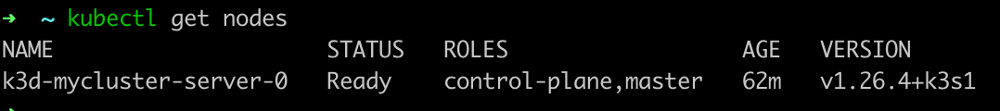
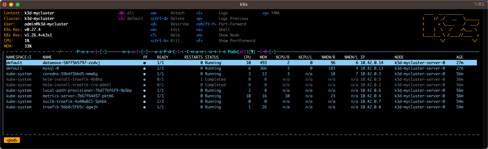
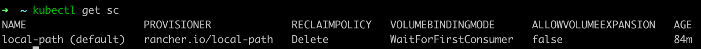
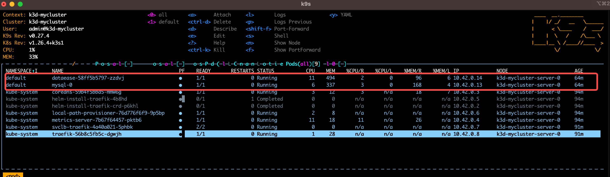
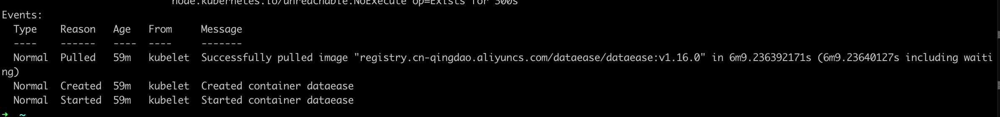

1\. Mac本地k8s上部署Dataease
=======================

1.1. Mac上部署k8s
--------------

### 1.1.1. Docker安装

[OrbStack · Fast, light, simple Docker & Linux on macOS](https://orbstack.dev/)

直接下载安装即可

### 1.1.2. 安装k3d

参考：[k3d-io/k3d: Little helper to run CNCF's k3s in Docker (github.com)](https://github.com/k3d-io/k3d)需要翻墙

`curl -s https:``//raw``.githubusercontent.com``/k3d-io/k3d/main/install``.sh |` `bash`

安装成功后，创建cluster

`k3d cluster create mycluster`

### 1.1.3. 安装kubectl

参考：[在 macOS 系统上安装和设置 kubectl | Kubernetes](https://kubernetes.io/zh-cn/docs/tasks/tools/install-kubectl-macos/#install-kubectl-binary-with-curl-on-macos)

下载对应Mac芯片的版本

将下载可执行文件移动到系统可执行目录，比如：/usr/local/bin

`mv` `kubectl` `/usr/local/bin`

### 1.1.4. 安装helm

下载[https://mirrors.huaweicloud.com/helm/](https://mirrors.huaweicloud.com/helm/)

`tar` `-zxvf helm-*-darwin-*.``tar``.gz`

`mv` `helm` `/usr/local/sbin/`

### 1.1.5. 验证k8s安装结果

输入如下命令，查看是否正常

`kubectl get nodes`

### 1.1.6. 安装k9s（可选）

下载 [Releases · derailed/k9s (github.com)](https://github.com/derailed/k9s/releases)

`tar` `-zxvf k9s_Darwin_*.``tar``.gz`

`mv` `k9s` `/usr/local/sbin`

k9s提供简易的交互界面，可以查看POD的运行情况，直接输入k9s命令进入

1.2. helm安装Dataease
-------------------

### 1.2.1. 下载dataease helm安装包

下载地址：[https://github.com/mfanoffice/dataease-helm/releases/](https://github.com/mfanoffice/dataease-helm/releases/)

`tar` `-zxvf dataease-1.16.0.tgz`

查看Mac本地k8s的storageClass类型

`kubectl get sc`

更新helm安装包里面values.yaml的storageClass

`······`

`common:`

`......`

`storageClass:` `local``-path`

`......`

`······`

`······`

进入安装包目录，执行helm安装命令

`helm` `install` `dataease .`

### 1.2.2. 验证dataease安装结果

k9s显示Running

k8s查看POD运行情况命令

`kubectl describe pod ${podName} -n default`

2\. OS上部署Dataease
=================

2.1. 安装包下载
----------

下载地址：[https://git.qingteng.cn/ms/infras/dataease/-/jobs/654737/artifacts/raw/dataease-1.16.0.tar](https://git.qingteng.cn/ms/infras/dataease/-/jobs/654737/artifacts/raw/dataease-1.16.0.tar)

命令行下载(linux/mac): qter pull [registry.qingteng.cn/ms-artifacts/infra/dataease:48ecab49](http://registry.qingteng.cn/ms-artifacts/infra/dataease:48ecab49)

命令行下载(window): qter.exe pull [registry.qingteng.cn/ms-artifacts/infra/dataease:48ecab49](http://registry.qingteng.cn/ms-artifacts/infra/dataease:48ecab49)

  

3\. 源码编译打包
==========

3.1. 环境准备
---------

参考：[https://dataease.io/docs/dev\_manual/dev\_deployment/tool/](https://dataease.io/docs/dev_manual/dev_deployment/tool/)

### 3.1.1. 编译环境

前端编译：nodejs

后端编译：java11、maven

maven依赖包：

3.2. 制作Docker镜像
---------------

编译前端，前端目录frontend下

`npm run build:stage`

编译后台，后台backend下

`mvn clean package`

Docker镜像，根目录下

`docker build -t registry.qingteng.cn``/ms-infra/dataease/dataease``:v1.18.10 .`